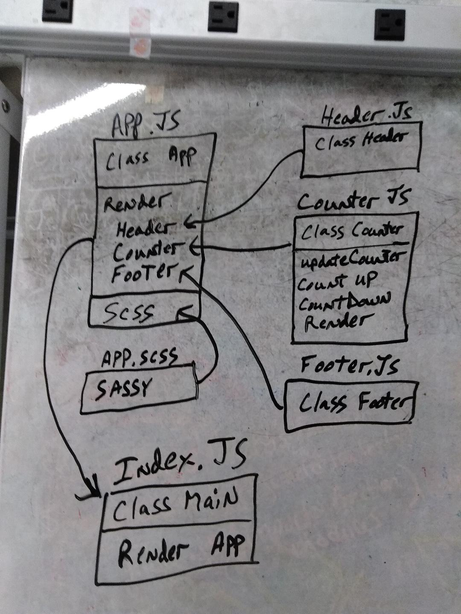

 LAB
=================================================

## Lab 27

### Author: Ed Puzino

### Links and Resources
* [repo](https://github.com/edpuzino/lab-27-code)
* [travis](https://travis-ci.com/edpuzino/lab-27)
* [AWS](http://xyz.com)
* [front-end](https://codesandbox.io/s/7jzk33okrq)

### Modules
#### `modulename.js`
##### Exported Values and Methods

###### `foo(thing) -> string`
Usage Notes or examples

###### `bar(array) -> array`

Usage Notes or examples

### Setup
#### `.env` requirements
* `PORT` - 3000
* `MONGODB_URI` - mongodb://localhost:27017/store

#### Running the app
* `npm start`
* Endpoint: `/foo/bar/`
  * Returns a JSON object with abc in it.
* Endpoint: `/bing/zing/`
  * Returns a JSON object with xyz in it.

#### Tests
* How do you run tests?
* What assertions were made?
* What assertions need to be / should be made?

#### UML

